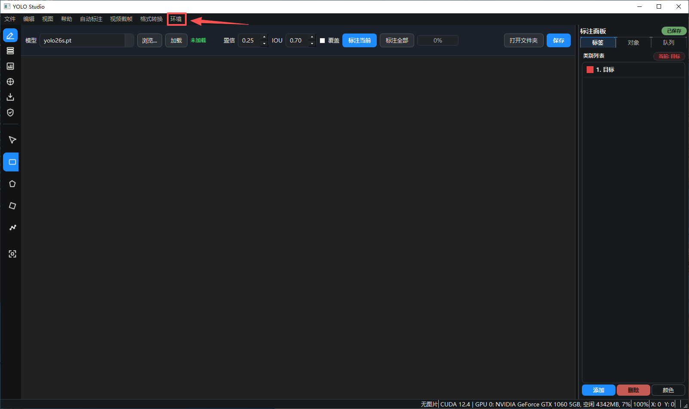
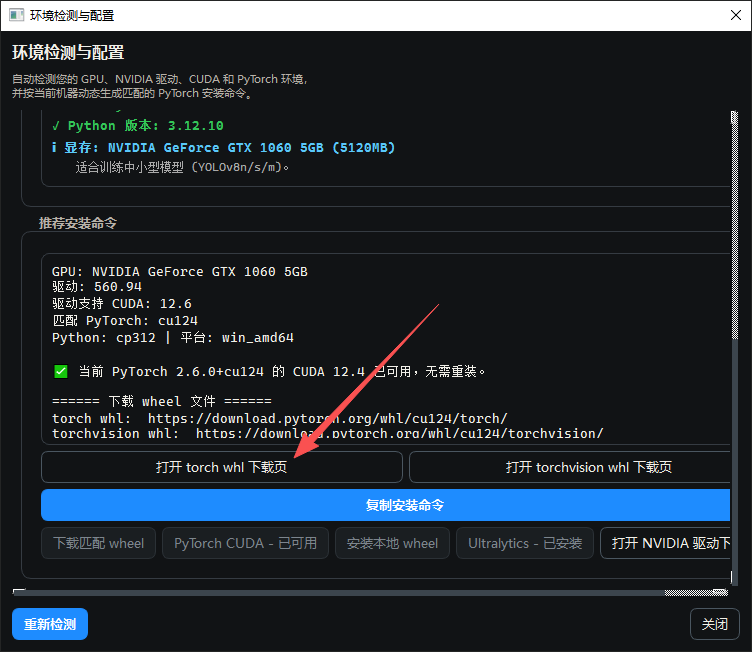
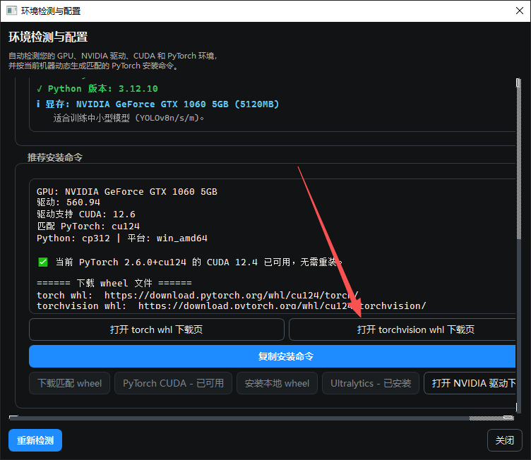
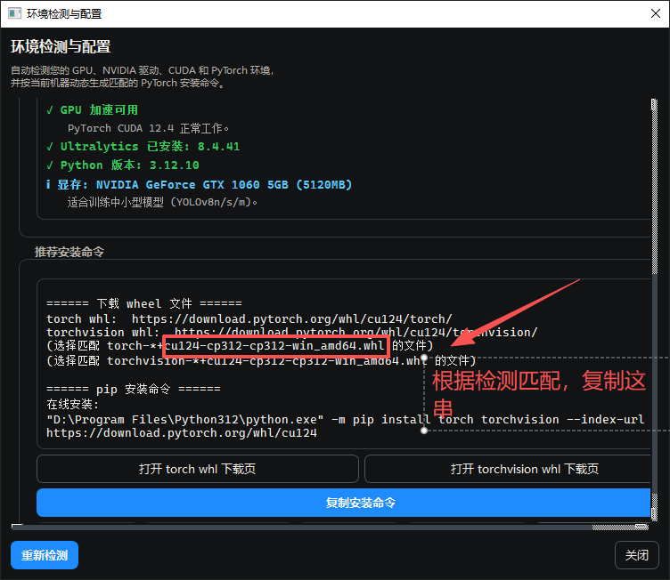
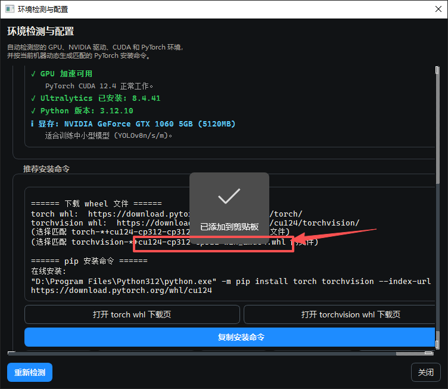
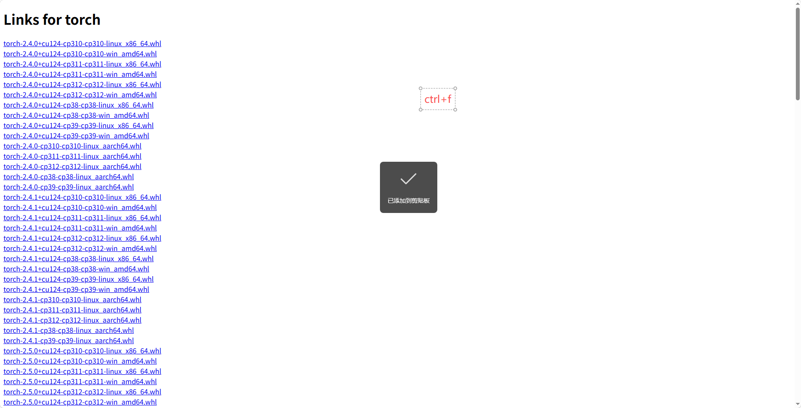
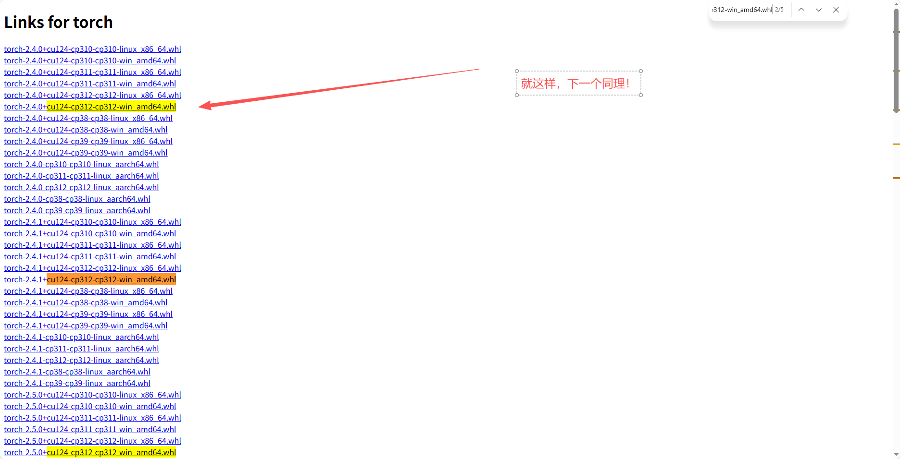
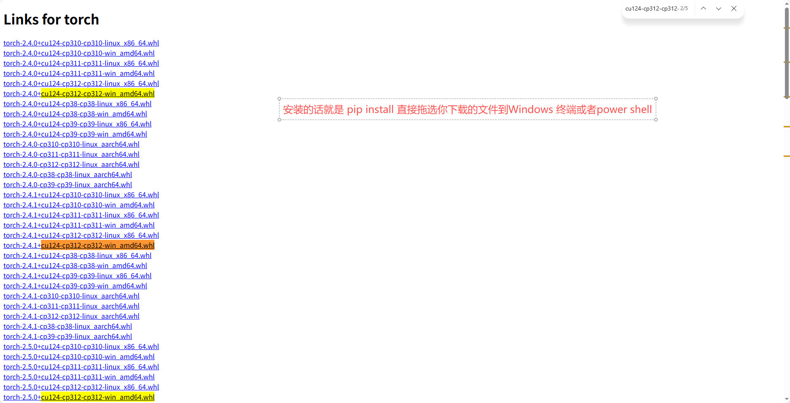

# YOLO Studio

<div align="center">


**专业的 YOLO 系列模型标注与训练桌面工作台**

</div>

---

## 项目简介

YOLO Studio 是一个基于 PyQt6 和 Ultralytics YOLO 框架开发的桌面端应用程序，提供完整的目标检测工作流支持，包括数据标注、数据集管理、模型训练、推理测试和格式转换等功能。

### 核心特性

- **本地化部署**：完全离线可用，数据隐私安全
- **模块化架构**：清晰的代码结构，易于扩展和维护
- **高效工作流**：针对 YOLO 任务优化的操作流程
- **多格式支持**：支持 YOLO、VOC、COCO、DOTA 等主流格式

---

## 功能模块

### 1. 标注工作台

- 支持多种标注类型：矩形框、多边形、旋转框、关键点
- 智能类别管理与颜色配置
- 文件队列导航与快速切换
- 自动保存与批量自动标注功能

### 2. 数据集管理

- YOLO 标准目录结构自动生成
- data.yaml 配置文件构建
- 训练集/验证集/测试集自动划分
- 数据集完整性检查

### 3. 训练面板

- 基于 Ultralytics 训练引擎
- 可视化参数配置界面
- 实时训练日志与指标监控
- 训练状态实时反馈

### 4. 推理面板

- 支持单张图片、目录批量、视频文件和摄像头实时推理
- 多种 YOLO 模型版本支持（YOLOv8、YOLO26）
- 检测结果可视化与导出

### 5. 导出与格式转换

- 支持 YOLO、Pascal VOC、COCO、DOTA 格式互转
- 灵活的导出路径配置
- 批量转换处理

---

## 环境要求

- **操作系统**：Windows 10/11
- **Python 版本**：3.10 或更高版本
- **GPU 支持**：CUDA 11.x+（可选，CPU 模式也可运行）
- **内存建议**：8GB RAM 以上

---

## 快速开始

### 安装依赖

```bash
pip install -r requirements.txt
```

### 启动应用

```bash
python main.py
```

---

## 项目结构

```text
Yolo Studio/
├─ core/        # 训练、推理、数据集、格式转换、配置等核心逻辑
├─ gui/         # 主窗口、画布、面板、对话框、主题
├─ resources/   # 图标等静态资源
├─ models/      # 本地模型文件
├─ configs/     # 配置文件
└─ main.py      # 应用入口
```

---

## 技术参考

本项目在开发过程中参考了以下优秀开源项目和技术文档：

### X-AnyLabeling

- **项目地址**：https://github.com/CVHub520/X-AnyLabeling
- **参考内容**：标注交互设计、自动标注流程、格式转换架构

### Ultralytics YOLO

- **官方文档**：https://docs.ultralytics.com/
- **参考内容**：训练/推理接口、数据集规范、模型导出

### PyQt6

- **官方文档**：https://www.riverbankcomputing.com/static/Docs/PyQt6/
- **参考内容**：GUI 框架、信号槽机制、自定义控件

### OpenCV

- **官方文档**：https://docs.opencv.org/
- **参考内容**：图像处理、绘制函数、格式转换

### 数据格式标准

- **COCO**：https://cocodataset.org/
- **Pascal VOC**：http://host.robots.ox.ac.uk/pascal/VOC/
- **DOTA**：https://captain-whu.github.io/DOTA/

---

## 许可证

本项目采用 GNU General Public License v3.0 开源许可证。

详细信息请参阅 [LICENSE](LICENSE) 文件。

---

<div align="center">

**如有问题或建议，欢迎提交 Issue 或 Pull Request**

</div>

---

## 模型下载

由于模型文件较大，已从代码仓库中移除。请从 [Releases](https://github.com/YDERO3452/Yolo-studio/releases) 页面下载所需模型文件。

### 可用模型列表

| 模型名称 | 文件大小 | 用途 |
|---------|---------|------|
| yolo26n.pt | 5.4 MB | YOLO26 Nano 目标检测 |
| yolo26s.pt | 19.9 MB | YOLO26 Small 目标检测 |
| yolo26n-seg.pt | 6.6 MB | YOLO26 Nano 实例分割 |
| yolo26n-pose.pt | 7.7 MB | YOLO26 Nano 姿态估计 |
| yolo26n-obb.pt | 5.8 MB | YOLO26 Nano 旋转框检测 |
| yolov8n.pt | 6.4 MB | YOLOv8 Nano 目标检测 |
| yolov8m.pt | 50.9 MB | YOLOv8 Medium 目标检测 |

下载后将所有 `.pt` 文件放置到项目根目录即可使用。

---

## CUDA 安装指南









